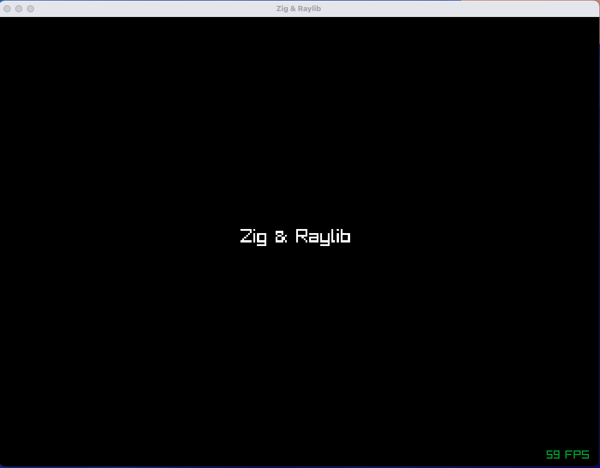

# Zig + Raylib Template

A minimal template project that demonstrates how to set up and use [Raylib](https://www.raylib.com/) with the [Zig programming language](https://ziglang.org/). This template provides a basic window with text rendering and FPS display, serving as a starting point for 2D/3D graphics applications and games.



## What This Project Does

When you run this template, it creates a 1024x768 window that displays:
- "Zig & Raylib" text centered on the screen
- FPS counter in the bottom-right corner
- A black background
- Runs at 60 FPS

This serves as a foundation for building more complex graphics applications, games, or interactive programs using Zig and Raylib.

## Prerequisites

Before setting up this project, make sure you have:

1. **Zig 0.14.1** installed on your system
   - Download from [ziglang.org/download](https://ziglang.org/download/)
   - Verify installation: `zig version`

2. **System dependencies for Raylib** (platform-specific):

   **Linux (Ubuntu/Debian):**
   ```bash
   sudo apt update
   sudo apt install build-essential git
   sudo apt install libasound2-dev libx11-dev libxrandr-dev libxi-dev libgl1-mesa-dev libglu1-mesa-dev libxcursor-dev libxinerama-dev
   ```

   **macOS:**
   ```bash
   # Xcode command line tools (if not already installed)
   xcode-select --install
   ```

   **Windows:**
   - Install Visual Studio with C++ build tools, or
   - Install MinGW-w64 or similar C compiler

## Quick Start

### Option 1: Using This Template

1. **Clone or download this repository:**
   ```bash
   git clone <your-repo-url>
   cd zig-raylib-template
   ```

2. **Build and run:**
   ```bash
   zig build run
   ```

That's it! The application should compile and launch a window.

### Option 2: Creating From Scratch

Follow these steps to recreate this template from scratch:

1. **Create a new Zig project:**
   ```bash
   mkdir my-raylib-project
   cd my-raylib-project
   zig init
   ```

2. **Add Raylib dependency:**
   ```bash
   zig fetch --save git+https://github.com/Not-Nik/raylib-zig#devel
   ```

3. **Configure build.zig:**
   - Update your `build.zig` to include Raylib dependency and linking
   - See the `build.zig` in this repository for reference

4. **Write your main.zig:**
   - Replace the default main.zig with Raylib initialization code
   - See `src/main.zig` for a basic example

5. **Build and run:**
   ```bash
   zig build run
   ```

## Build Commands

This project supports several build commands:

```bash
# Build and run the executable (most common)
zig build run

# Just build the executable
zig build

# Build in release mode for better performance
zig build -Doptimize=ReleaseFast

# Run tests
zig build test

# Clean build artifacts
rm -rf zig-out/ zig-cache/
```

## Project Structure

```
zig-raylib-template/
├── build.zig              # Build configuration and Raylib integration
├── build.zig.zon          # Package configuration with dependencies
├── src/
│   ├── main.zig           # Main application entry point
│   └── root.zig           # Library module (contains basic utilities)
├── screenshots/           # Project screenshots
├── zig-out/              # Build output directory (created after build)
└── README.md             # This file
```

### Key Files Explained

- **`build.zig`**: Configures the build system, links Raylib, and sets up both library and executable targets
- **`build.zig.zon`**: Defines package metadata and dependencies (including raylib-zig)
- **`src/main.zig`**: The main application that creates a window and handles the render loop
- **`src/root.zig`**: Library module that can contain reusable functions (currently has a simple add function)

## Understanding the Code

The main application (`src/main.zig`) demonstrates several key Raylib concepts:

```zig
// Initialize window
rl.initWindow(1024, 768, "Zig & Raylib");
defer rl.closeWindow(); // Automatic cleanup

// Set framerate
rl.setTargetFPS(60);

// Main game loop
while (!rl.windowShouldClose()) {
    rl.beginDrawing();
    defer rl.endDrawing(); // Automatic cleanup
    
    // Your drawing code here
    rl.clearBackground(.black);
    rl.drawText("Hello World", x, y, size, .white);
}
```

## Troubleshooting

### Build Errors

**"raylib_zig dependency not found"**
- Run `zig fetch --save git+https://github.com/Not-Nik/raylib-zig#devel` again
- Check that `build.zig.zon` contains the raylib_zig dependency

**Linking errors on Linux**
- Install the required system libraries listed in Prerequisites
- Make sure you have a C compiler installed

**"zig: command not found"**
- Ensure Zig is properly installed and in your PATH
- Try `zig version` to verify installation

### Runtime Issues

**Window doesn't appear**
- Check if you have proper graphics drivers installed
- Try running in a different terminal or environment

**Performance issues**
- Build in release mode: `zig build -Doptimize=ReleaseFast`
- Check if VSync is causing issues on your system

## Next Steps

This template provides a foundation for building graphics applications. Consider exploring:

1. **Raylib features**: Sprites, audio, input handling, 3D rendering
2. **Zig language features**: Comptime, error handling, memory management  
3. **Game development patterns**: Entity systems, scene management, asset loading
4. **Advanced graphics**: Shaders, textures, animations

## Resources

- [Raylib Documentation](https://www.raylib.com/)
- [Raylib-Zig Bindings](https://github.com/Not-Nik/raylib-zig)
- [Zig Language Documentation](https://ziglang.org/documentation/)
- [Zig Build System](https://ziglang.org/learn/build-system/)

## AI Transparency

This README.md was edited and enhanced using Claude Sonnet 4. The actual code and project setup are not LLM generated.

## License

This template is released under the MIT License, which allows you to use, modify, and distribute it for any purpose, including educational, commercial, and personal projects.

**Compatibility Note:**
This MIT license is fully compatible with the underlying technologies:
- **Zig**: Uses MIT License
- **Raylib**: Uses zlib/libpng License (very permissive)
- **Raylib-Zig bindings**: Uses zlib License

You are free to use this template as a starting point for any project without restrictions. The only requirement is to include the original copyright notice if you redistribute the template code itself.

